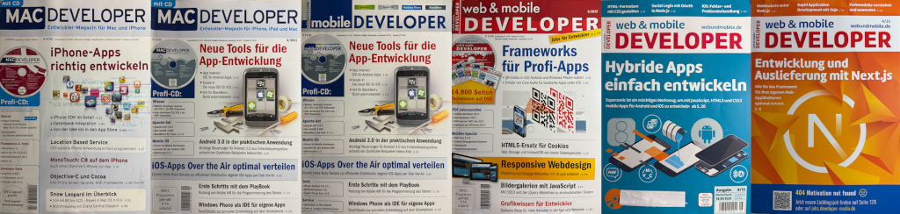

# Web-Mobile-Developer

Im Dezember 2009 erschien die erste Ausgabe der Zeitschrift Mac Developer (1/2010) und es folgten 7 weitere Ausgaben - erst im Quartalsabstand und zum Schluss im Zwei-Monatsabstand.
Da neben reiner iOS Programmierung auch immer mehr Cross-Plattform-Entwicklung angesprochen wurde, entschied sich der Verlag [diese Zeitschrifft](https://x.com/Anrufliste/status/1503049330084790278/photo/1) mit der Mobile Developer Android zusammenzulegen.
So hatte die Ausgabe 4/2011 ein [Wendecover](https://x.com/Anrufliste/status/1503050386504101895) und war zugleich auch die neue Mobile Developer 7/2011, welche nun monatlich erschien.
Durch die Cross-Plattform-Entwicklung wurden auch immer wieder Web Technologien besprochen, sodass sich der Verlag im Sommer 2012 abermals entschied das Magazin mit der Zeitschrift Web Developer zusammenzulegen.
So erschien mit der Ausgabe 6/2012 zum ersten Mal die Web & Mobile Developer.
[Anfangs war das Logo immer rot](https://x.com/Anrufliste/status/1505275421243363331/photo/1), aber mit der Ausgabe 8/15 [wechselte die Hintergrundfarbe](https://x.com/Anrufliste/status/1508307503800623114/photo/1) jeden Monat [bis zur Ausgabe 04/23](https://x.com/Anrufliste/status/1840422773895663913/photo/1), mit der dieses Magazin eingestellt wurde.
Der Verlag bot den Abonnenten einen Wechsel zum weiter erscheinenden [Zeitschrift dotnetpro](https://www.dotnetpro.de) an.

Der Verlag führte auch noch eine zeitlang das Online Archive weiter, aber schlussendlich wurde auch dieses abgeschaltet - [die aktuellsten Beiträge wurden noch in das Archiv des Magazins dotnetpro übernommen](https://www.dotnetpro.de/webundmobile-2715738.html), aber leider nicht alle.

# Meine Alexa Artikel

Nach Jahren als treuer Leser entschied ich mich Anfang 2018 zum Schreiben eigener Artikel.
Zu dieser Zeit begeisterte ich mich für die Alexa Skill Entwicklung, aber es gab kaum Material darüber.
So musste ich viel selber experimentieren und was lag da näher, als die gewonnen Erkenntnisse auch zu veröffentlichen.
So entstanden für 8 Ausgaben der Web & Mobile Developer insgesamt 9 Artikel. Leider wurden diese nicht mit in das Archiv der dotnetpro übernommen.
Aber dankenswerterweise hat mir [Fernando Schneider, der Chefredakteuer der dotnetpro](http://https://developer-media.de/team/), die Erlaubnis gegeben, die PDF Version meiner Artikel in diesem GitHub Repository zu veröffentlichen, sodass ich diese in neuen Arbeiten weiterhin verlinken kann.
 
## 04/2018 - Ein Skill-Backend mit PHP

[Mein erster Artikel](wmd_0418_S114_118.pdf) beschreibt, wie man ein erstes Alexa-Skill konfiguriert und mit minimalem PHP-Code ein Backend für dieses bereitstellt.
In diesem müssen zuerst die 6 Request- und 2 Zertifikats-Prüfungen erfolgen, welche Amazon für die Skill-Freigabe vorschreibt.
Werden diese verletzt, muss einer von zwei Fehlercodes zurückgegeben werden.
Ansonsten kann das Skript die Anfrage abarbeiten und eine Antwort generieren. 
Am Ende verweist der Artikel auf 3rd Party PHP Bibliotheken / Frameworks, welche einem diesen Basiscode abnehmen und die implementierung der Skill-Logik erleichtern.
(Amazon selbst stellt nur SDK für [Node.js](https://github.com/alexa/alexa-skills-kit-sdk-for-nodejs), [Java](https://github.com/alexa/alexa-skills-kit-sdk-for-java) und [Python](https://github.com/alexa/alexa-skills-kit-sdk-for-python) bereit)
 
## 06/2018 - Personalisierung

In [meinem zweiten Artikel](wmd_0618_S126_129.pdf) behandele ich die Möglichkeiten ein Skill zu personalisieren.
Zuallererst ist dies natürlich mit einer Skill Session und den SessionAttributes möglich, wodurch sich ein Skill die aktuelle Eingabe / Konversation "merken" kann.
Dieser Ansatz lässt sich erweitern, indem man auf dem Server auch auch eine Session startet. 
Allerdings sollte diese nicht mit der SessionID sondern der UserID des Skill-Request koppeln, sodass die Server-Session auch über Skill-Sessions hinweg funktioniert.
Von hier ist es ein kurzer Weg den Skill-User mittels Account-Linking mit eigenen User-Daten zu verknüpfen.
 
## 07/2018 - Von der App zum Skill

Nach der Verknüpfung eines Online Accounts, widmet sich [mein dritter Artikel](wmd_0718_S118_119.pdf) der Frage, wie man das Skill aus einer App oder einem Online Auftritt bewerben kann.
Dabei ist das Ziel, dass der Nutzer entsprechend der Plattform möglichst nahtlos zum Skill und dessen Aktivierung geführt wird.
Amazon selbst hat diesem Thema kaum Dokumentation gewidmet, sodass es sich hier um Reverse-Engineering derer Webseite und App handelt.
Insofern sind die erläuterten Möglichkeiten keine offiziellen APIs und so wurden ohne weitere Ankündigungen die Weblinks abgeändert, dass diese nun zum Download der Alexa App führen.
Der DeepLink in die App funktioniert allerdings noch - jetzt sogar unter iOS.
 
## 10/2018 - Audiowiedergabe

Nachdem die bisherigen Artikel den Fokus eher auf dem Aufruf des Skills hatten, behandelt der [mein vierter Artikel](wmd_1018_S096_100.pdf), wie ein Skill antworten kann.
Angefangen mit dem normalen Text, welchen Alexa per TTS in Sprache übersetzt, folgt dann SSML, mit dem die Sprach-Synthetisierung feiner gesteuert werden kann.
In diesem Zusammenhang wird die Alexa Skill Kit Sound Library vorgestellt, in der bereits vorproduzierte Soundfiles (zur einfachen Integration in die Synthetisierung) bereitgestellt werden. 
Mit erheblichen Einschränkungen lassen sich auch eigene Soundfiles in SSML benutzten.
Weniger Einschränkungen für die MP3-Dateien, aber erhöhter Aufwand und das Verlassen des Skills ist mit dem Audio-Player Interface möglich, welches zum Schluss vorgestellt wird.
 
## 01/2019 - Bildschirmausgabe mittels Card

Die Alexa App führte schon immer Protokoll über die Interaktion eines Nutzers und dessen Alexa Skills. Hierfür führte Amazon die Skill-Cards ein, damit ein Skill die dortige Ausgabe formatieren kann. 
Mit dem Echo Show und Echo Spot erhielt der Echo auch einen Bildschirm für die direkte Ausgabe dieser Cards.
Auch die Alexa Integration im Fire-TV (Cube & Stick) eröffnete einem Skill, informationen auf dem Bildschirm auszugeben.
[Mein fünfter Artikel](wmd_0119_S112_116.pdf) widmete den verschiedenen Skill-Cards und wie diese auf den unterschiedlichen Bildschirmen ausgegeben werden.

Darüber hinaus gab es ein minimales Update zur SSML unterstützung (siehe 10/2018).
 
## 05/2019 - Bildschirmausgabe mittels Display-Interface

**-- Amazon hat das Display-Interface im [Sommer 2021 entfernt](https://developer.amazon.com/en-US/blogs/alexa/alexa-skills-kit/2021/06/-goodbye-display-templates--hello-alexa-responsive-templates) --** 

[Mein sechster Artikel](wmd_0519_S114_122.pdf) beschäftigt sich mit der Übergangstechnologie Display Templates, mit denen zwar komplexere Layouts mögliche waren als mit Skill-Cards, aber nur in vordefinierten Varianten.
In dem Artikel ist beschrieben, wie sich diese Varianten auf den unterschiedlichen Bildschirmen (in der darstellbaren Inhaltsmenge) unterscheiden.
Das bereits APL als flexiblere Ablösungstechnologie im Beta-Status zur Verfügung stand, wurde bereits erwähnt.
 
## 09/2019 - Echo Show 5

Mit der [Vorstellung des Echo Show 5](https://press.aboutamazon.com/de/2019/5/amazon-stellt-echo-show-5-vor-kompaktes-design-voller-klang-und-integrierte-kameraabdeckung-fuer-nur-89-99-euro) führte Amazon eine neue Bildschirmgröße ein.
Dementsprechend untersuchte ich in [meinem siebten Artikel](wmd_0919_S128_129.pdf), wie sich die verschiedenen Ausgabe-Optionen (s.o.) auf diesem verhalten.
Zusätzlich enthält der Artikel ein Update zur Alexa Skill Kit Sound Library und listet die neue Anzahl an Sound Files in den teils neuen Kategorien auf.
 
## 02/2020 - Echo Show 8 & Alexa Presentation Language
In dieser Aussage wurden zwei Artikel von mir veröffentlicht.
Zum einen [meinen achten Artikel](wmd_0220_S056_057.pdf), der ähnliche wie der Siebte ein Geräte-Update zum Echo Show 8 war.
Daneben enthält er ein kleines Update zur SSML Unterstützung und eine wichtige Änderung zum Account-Linking Prozess unter iOS.

Zum anderen [meinen neunten Artikel](wmd_0220_S058_069.pdf), welcher mein bisher umfangreichster war und mir sogar eine Erwähnung auf dem Titel-Cover der Ausgabe einbrachte, behandel ich die Amazon Presentation Language (APL) welche der neue Standard für die grafische Ausgabe ist.
Da Amazon selbst eine [umfangreiche Dokumentation zur APL](https://developer.amazon.com/en-US/docs/alexa/alexa-presentation-language/apl-for-screen-devices.html) bereitstellt, beschränke ich mich auf die vorstellung der wesentlichen Sprachelemente.
Ergänze dies aber um etliche Sonderfälle, welche nicht explizit in der Dokumentation geklärt sind und die ich experimentell ermittelt habe.
Dadurch kann sich dieses Verhalten natürlich auch ohne weitere Erwähnung von Amazon in Zukunft verändern.

Ein Beispiel ist die [Auflistung von 410 damals nicht unterstützer Emojis](https://x.com/anrufliste/status/1217137755643400198?s=21).
Für diese Analyse habe ich nach einigen Jahren auch ein [eigenes GIT Projekt](https://github.com/Anrufliste/Alexa-Devices-Facts/tree/main/emoji) veröffentlicht, welches auch Auskunft über die Audio-Unterstützung der Emojis auf Englisch und Deutsch gibt.
